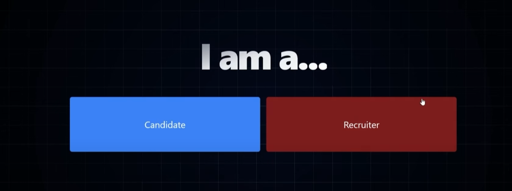
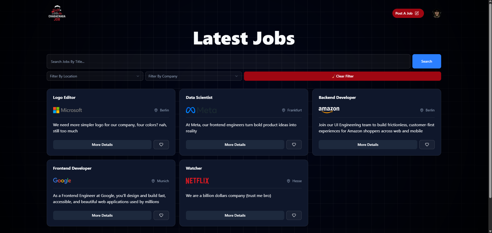
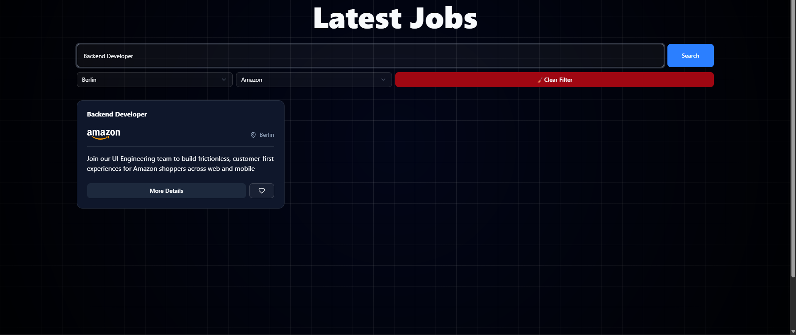
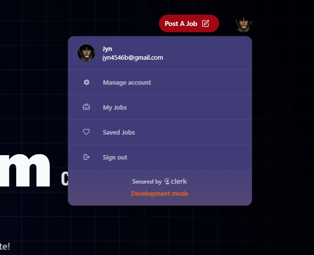
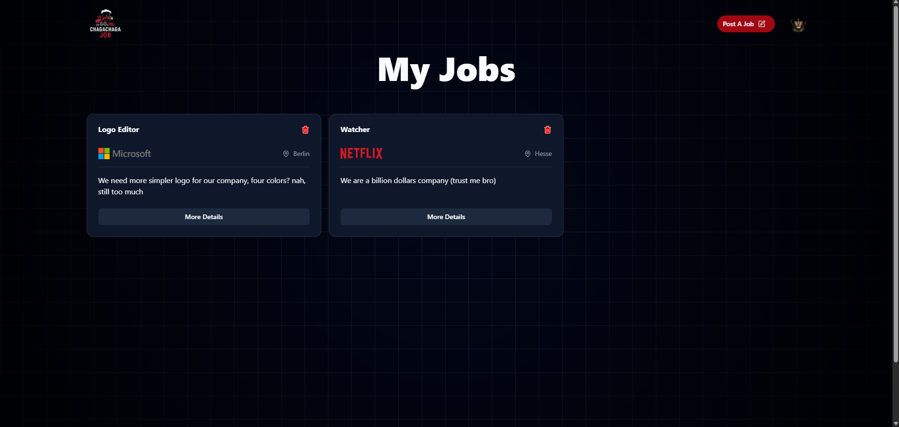

# ChagaChaga Jobs

ChagaChaga Jobs is a full-stack job board app that simplifies job hunting and hiring. Users can sign up, post jobs, apply, save listings, and manage everything from a clean, modern UI — no clutter, just action.

---

## Features

- 🔎 Browse & apply to jobs instantly
- 📝 Post jobs with ease (and delete them too)
- 🔐 Secure Clerk-authenticated sign-up
- 🎯 Smart search & filters to find the right jobs
- ❤️ Save jobs you’re interested in
- 🧾 View your saved & posted jobs in a dedicated space

---

## Tech Stack

- Vite + React
- JavaScript
- Supabase
- Clerk

---

## Screenshots

### 🧭 Onboarding
 
### 📄 Job Listing Page
  
### 📜 Detailed Job Page

### 🔍 Filtered Job
  
### 🧑‍💻 Accessing My Jobs
  
### 💯 All Created Jobs
  

---

## Live Preview

https://chagachaga-jobs.vercel.app/

---

## 🛠️ Running Locally

```bash
git clone https://github.com/derarshan/chagachaga-jobs.git
cd chagachaga-jobs
npm install
npm run dev
```

---

## Why this project?

This app was built to practice full-stack skills using real-world tools like Supabase and Clerk. It helped me understand auth, database integration, filtering logic, and user-centric UI — all while building something that solves a real problem.

---

Made with purpose by [@derarshan](https://github.com/derarshan)  
"ChagaChagaChagaChaga"

